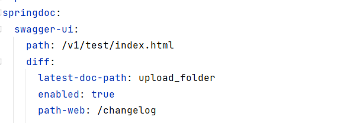
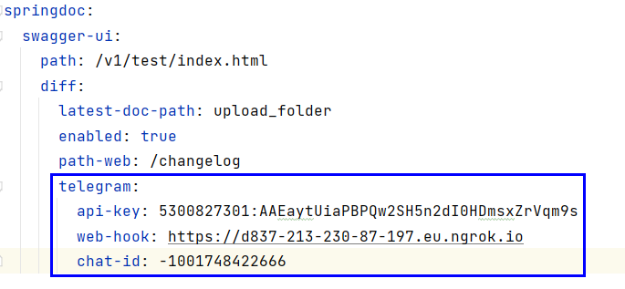
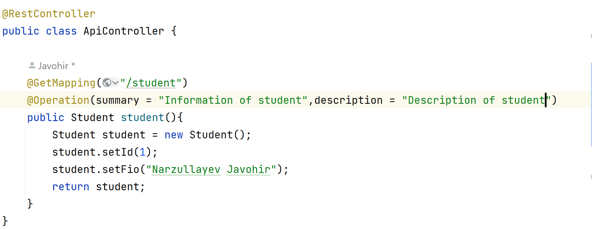
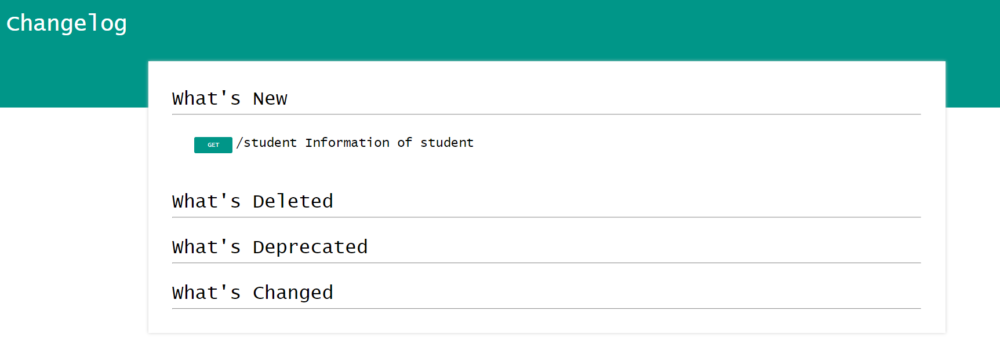

# 
## Forked from 
https://github.com/Sayi/swagger-diff

## Introduction
Spring swagger diff it is util and allow anyone - be it development team or your end consumers -to visualize and notify any changes from  API’s resources without having any of the implementation logic in place. It’s automatically check difference version of api documentation and show in page changes and send changes to telegram group or channel
```java
   <dependency>
         <groupId>uz.narzullayev.javohir</groupId>
         <artifactId>autoconfigure</artifactId>
         <version>1.0</version>
   </dependency>
```
This utility depend on dependency springdoc-openapi-ui
```java
   <dependency>
       <groupId>org.springdoc</groupId>
       <artifactId>springdoc-openapi-ui</artifactId>
       <version>1.6.8</version>
   </dependency>
```
### Init config


```path``` : visual url of swagger-ui <br/>
```latest-doc-path``` : storage path of api documentation  <br/>
```path-web``` - visual url of swagger-changes  <br/>

### Telegram config


```api-key``` : api key telegram <br/>
```web-hook``` : your secured application url <br/>
```chat-id``` : telegram chat id <br/>

### Example of working
```Added new api```




